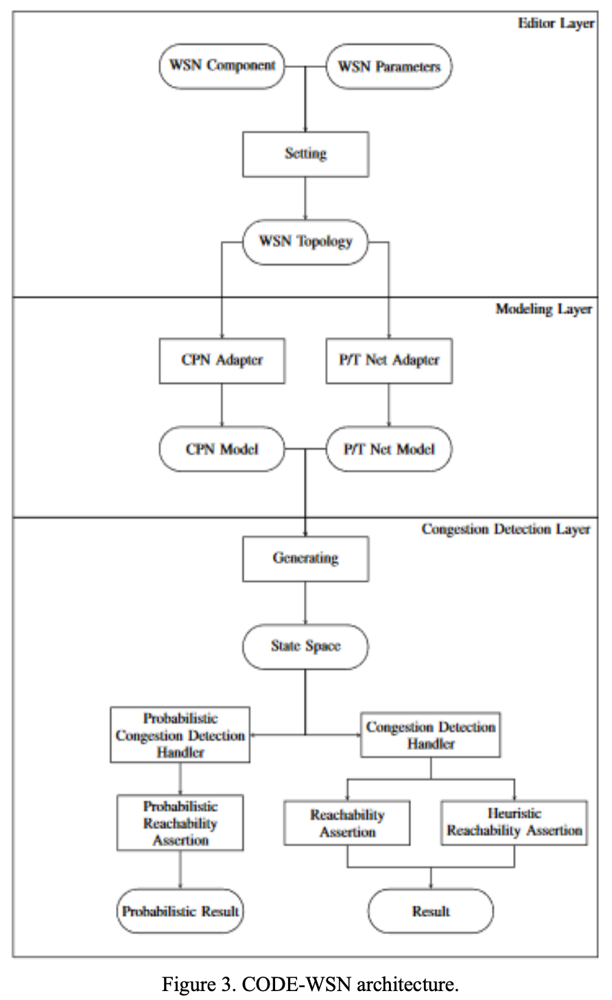

# WebApp
## Architecture
Here is the architecture of the tool called CODE-WSN, which is described in detail in [1].

[1] Le Khanh, Bao Pham, Quan Tram, Thang Bui, and Tho Quan. "CODE- WSN: A Formal Modelling Tool for Congestion Detection on Wireless Sensor Networks." In 2018 IEEE World Symposium on Communication Engineering (WSCE), pp. 1-7. IEEE, 2019.

## Authors
  * Tram Loi Quan - Ho Chi Minh City University of Technology
  * Pham Ngo Gia Bao - Ho Chi Minh City University of Technology
  * Le Ngoc Kim Khanh - Sai Gon University
